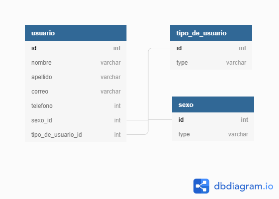

# Rails prueba

## Modelo relacional

# Documentación técnica
## Prerequisitos
* Ruby version
 2.7.0

* Dependencias del sistema
Windows/ Unix
Rails 6.0.2

## Instalación
Clonar el proyecto

`git clone https://github.com/Grifo89/prueba.git`

Installar Dependencias

`bundle install --without production`

`yarn install`

Crear la base de datos y poblarla

`rails db:migrate`

`rails db:seed`

Correr el servidor

`rails serve`

## Ingeniero

👨‍💻 **Christian Salazar**

- Github: [@grifo89](https://github.com/grifo89)
- Twitter: [Christian_sm91](https://twitter.com/Christian_sm91)
- LinkedIn: [Christian Salazar](https://www.linkedin.com/in/christian-salazar-mi%C3%B1o/)

‍‍
